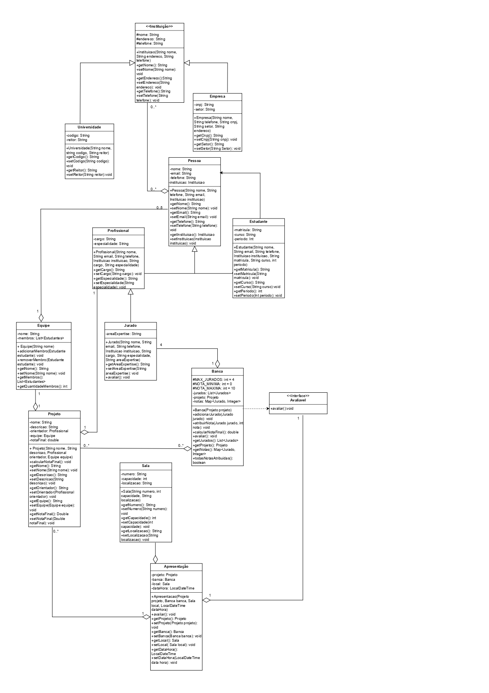

## Alunos:

### Nome: Pedro Henrique e Joao Victor

# Sistema de Gerenciamento de Hackathon Universitário

## Índice
- [Visão Geral](#visão-geral)
- [Funcionalidades](#funcionalidades)
- [Arquitetura](#arquitetura)
- [Conclusão](#conclusão)
---

## Visão Geral

**Sistema de Gerenciamento de Hackathon Universitário** 

### Principais Objetivos:
- Gerenciar equipes de estudantes e seus projetos
- Organizar bancas avaliadoras com jurados especializados
- Agendar e controlar apresentações
- Calcular notas finais e determinar projetos aprovados
- Gerar relatórios e estatísticas do evento

---
### Diagrama de Classes UML

## Funcionalidades

### Gestão de Equipes
- Criação de equipes com até 5 membros
- Adição e remoção de estudantes
- Controle de quantidade de membros por equipe

### Gestão de Participantes
- Cadastro de estudantes com informações acadêmicas
- Registro de profissionais orientadores
- Cadastro de jurados especialistas

### Gestão de Projetos
- Criação de projetos com descrição e orientador
- Vinculação de projetos às equipes
- Cálculo automático de notas finais

### Gestão de Apresentações
- Agendamento de apresentações
- Alocação de salas e horários
- Formação de bancas avaliadoras
- Sistema de avaliação com múltiplos jurados

### Relatórios e Estatísticas
- Lista de projetos aprovados (nota ≥ 7.0)
- Média geral das avaliações
- Estatísticas de participação

---

## Arquitetura

### Principais Classes:
- **Pessoa** (abstrata): Classe base para estudantes, profissionais e jurados
- **Instituição** (abstrata): Universidades e empresas
- **Projeto**: Representa os projetos desenvolvidos
- **Equipe**: Gerencia grupos de até 5 estudantes
- **Banca**: Conjunto de jurados que avaliam projetos
- **Apresentação**: Agendamento e controle das apresentações

### Padrões de Projeto:
- **Singleton**: Coleções `Equipes` e `Apresentações`
- **Strategy**: Interface `Avaliavel` (Banca e Jurado)
- **Template Method**: Classes abstratas com hierarquia definida

---
## Conclusão
Este sistema demonstra a aplicação prática de conceitos fundamentais de programação orientada a objetos em Java, incluindo:

- **Herança**: Hierarquias de Pessoa e Instituição
- **Polimorfismo**: Interface Avaliavel implementada por diferentes classes
- **Encapsulamento**: Atributos privados com getters/setters
- **Padrões de Design**: Singleton para controle de coleções
- **Validações**: Regras de negócio implementadas (limites, datas, notas)
- **Streams**: para filtragem e processamento de dados

